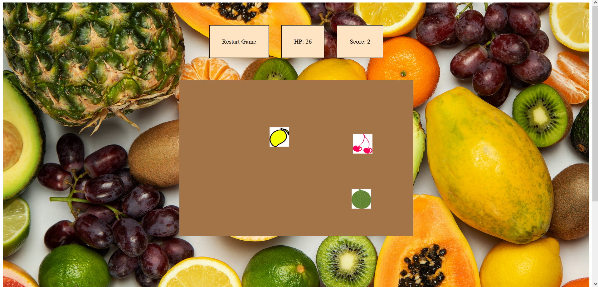

# Fruit-Ninja-Clone

A simplified web version of fruit ninja game.
he player has 30 lives and an unlimited amount of time to slice as many fruits as possible.
ny time the player misses one fruit, the player would lose one life until no life is left.
This game is programmed by HTML, CSS, JavaScript, p5.js, jQuery.

Updates: 
1. Cleaned up the directory structure (using lib/ and src/) and code base.
2. Refactored the code base with library p5.js, this library allows us to simulate gravity and create game animations in a vastly easier and fancier way.

3. **Potential enhancements (currently in scoping phase):
3.1 Using React/Angular to further develop the front-end.
3.2 Create a backend to allow different people to log in as different user accounts and store their scores.
3.3 Check out tensorflow.js and create an game AI that user can play against. (Imagine two frames on the same screen which generate the same fruits targets, one frame for human player, one frame for AI, and after certain amount of time, we compare scores between AI and human player to decide winner and loser.)
3.4 Create API for other people to train their own AI?
**

Here is the demo video of the latest version of the game:
[Video Demo of Fruit Ninja Clone](https://youtu.be/QpzxffVsWHg)

Here is a screen shot of the game:

